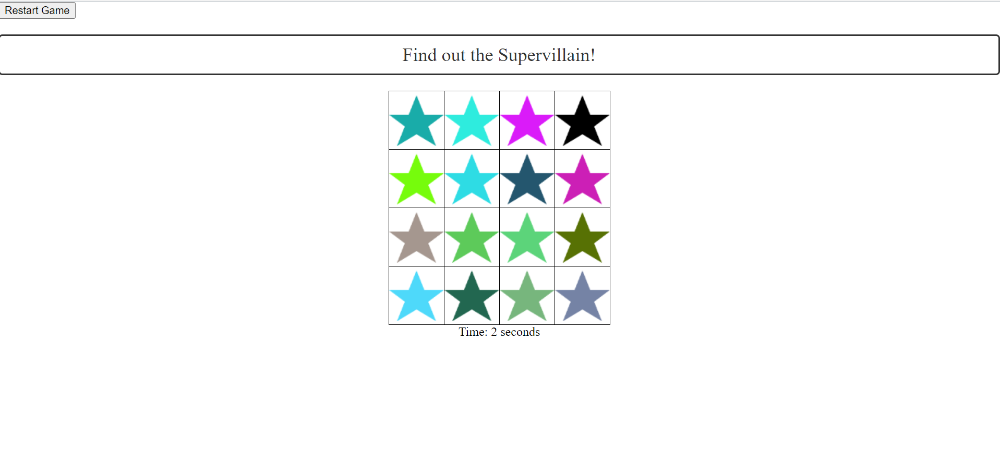

# Supervillain - Unmask the Sneaky Star!

**Supervillain** is a captivating web-based game where your mission is to identify the mischievous supervillain star hidden among a constellation of innocent stars. Dive into the cosmic mystery and see if you have what it takes to uncover the villain!

## How to Play

- **Start Your Investigation:** Click on any star in the night sky to begin your search. Each star has a unique color and personality.
- **Discover Humorous Clues:** Regular stars reveal amusing messages as you investigate them. Enjoy a good chuckle while tracking down the villain.
- **The Villain Emerges:** The supervillain star may look identical to the others, but it won't remain concealed for long. Keep exploring, and it will reveal itself when you find it.
- **Race Against Time:** A timer is ticking! Try to expose the supervillain as quickly as possible. The fate of the galaxy depends on your detective skills.

## Features

- Engaging gameplay that keeps you enthralled.
- Randomly generated stars, each with its own distinct color.
- A cunning supervillain star hidden among ordinary stars.
- A timer to test your detective prowess.
- Delightful and amusing messages throughout the game.
- Restart the game anytime for another thrilling adventure.

## Controls

- Click on any star to investigate.
- Press "Restart Game" to begin a new challenge.

## Installation

1. Clone this repository to your local machine.
2. Open the `index.html` file in a web browser to embark on your supervillain hunt.

## Join the Hunt!

Are you prepared to confront the enigmatic supervillain star and save the galaxy? Don your detective hat, click your way through the night sky, and immerse yourself in the whimsical universe of **Supervillain**!

**Play the game here** (Replace with your game's URL once it's hosted).

